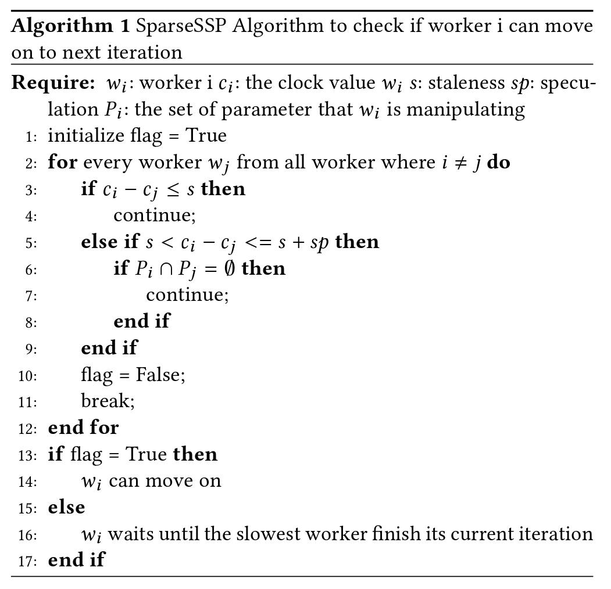

# SparseSSP




On the base of SSP, when the clock (current iteration) difference between the slowest and fastest workers reaches ```staleness```, we check the parameters that these two workers are manipulating. If the parameters that there are using have no intersections, then we let the fastest worker move on for at most ```speculation``` iterations to further reduce the worker's waiting time.


A graph description is as below:


