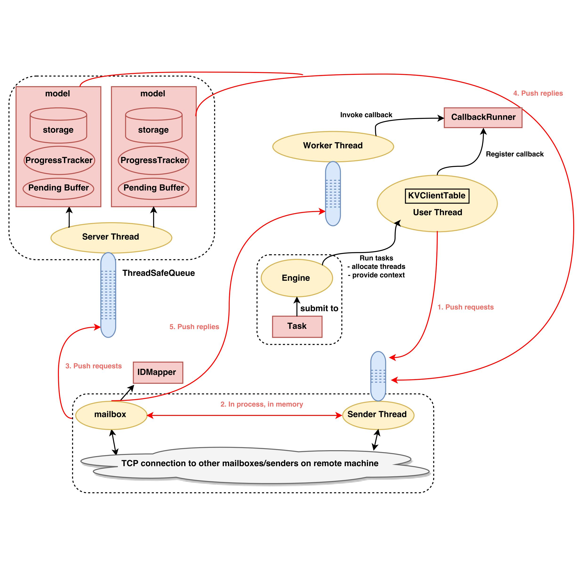

# System Architecture




Typical workflow:

1. User submit their tasks to the Engine (driver), then Engine will run the tasks and allocate the corresponding resources. The ```KVClientTable``` will register a ```CallbackRunner``` to handle the subsequent requests. After extracting the needed parameters for current iteration from the data, the user thread would push a request to the sender thread of the mailbox to ask for the corresponding parameters.
2. The sender thread process the requests in a FIFO manner, using a ```IDMapper``` to find out the actual receiver's address in the cluster.
3. Mailbox send the ```get()```/```add()``` requests to the server to retrieve/update the corresponding parameters.
4. The server handles the requests and push replies to the sender thread of the mailbox.
5. Mailbox handles the replies and pushes replies to the worker thread, and worker thread invokes the callback runner to continue the user thread's tasks.


Reference: [TatianaJin/csci5570](https://github.com/TatianaJin/csci5570/blob/master/mindmap.svg)

